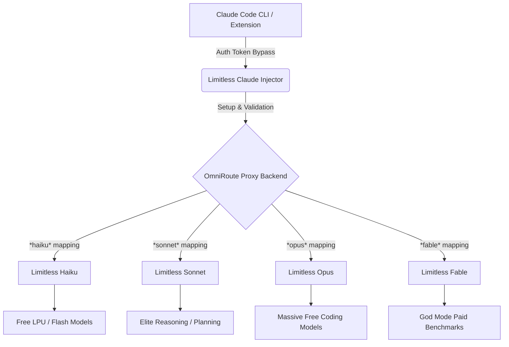

# Limitless Claude

**Unlock God-Tier Capabilities in Claude Code CLI & VS Code Extension**

Limitless Claude is an advanced orchestration, mapping, and proxy layer designed to supercharge your Claude Code environment. Instead of being restricted to official models or hitting arbitrary rate limits, this repository bridges Claude Code to the **OmniRoute** backend. 

It organizes the world's most powerful frontier models into 4 distinct, auto-cascading tiers, allowing you to utilize free API limits while preserving your paid tokens for when you truly need them.

---

## 🧠 The Core Concept

Claude Code natively relies on a static list of Anthropic models. Limitless Claude bypasses these hardcoded restrictions using custom database injection (`setup.js`). 

We map Claude Code's native effort levels directly to our **Limitless Tiers**. If a model hits a rate limit or throws an error, the system instantly cascades (in under 15ms) to the next best model in that tier. This guarantees zero timeouts, zero UI clutter, and 100% optimal token usage.

### System Architecture



---

## 🏗️ The 4 Limitless Tiers

**1. Limitless Haiku (Flash Speed)**
Designed for instant responses, basic CLI commands, and rapid syntax checks. Powered by wafer-scale LPUs and lightning models (Groq, Gemini Flash, etc.) to ensure sub-second Time-To-First-Token.

**2. Limitless Sonnet (Architecture & Deep Reasoning)**
Designed for system design, deep logic, and architectural planning. This tier prioritizes top-tier reasoning models (like DeepSeek Reasoner, o1-preview, and Claude 3.5 Sonnet) regardless of cost, because flawless planning is critical.

**3. Limitless Opus (Raw Coding Frontier)**
Designed for massive codebase refactors and autonomous agentic coding. This tier maximizes free daily quotas across dozens of providers first, keeping your premium paid tokens safely loaded at the bottom as unbreakable fallbacks.

**4. Limitless Fable (God Mode)**
When API limits do not matter. This tier ignores token costs and is strictly ordered by the absolute highest LMSYS, SWE-Bench, and GPQA benchmarks on the planet.

---

## 🔌 Suggested Providers

You can use Limitless Claude with *any* providers you configure in OmniRoute. However, for the **ideal, fully-optimized installation**, we highly recommend configuring the following 19 providers. Our setup script will dynamically map their best models into your tiers automatically:

`AgentRouter, Antigravity, Bluesminds, Cerebras, Cloudflare AI, DeepSeek, DuckDuckGo, GitHub Copilot, Groq, HuggingChat, Kilo-Gateway, Kiro, Mistral, Muse-Spark Web, Nvidia, Ollama Cloud, OpenCode, OpenRouter, Qwen Web.`

---

## 🚀 Installation & Setup

### Option A: AI Agent Installation (Recommended)

The easiest way to install Limitless Claude is to have your AI assistant (Cursor, Antigravity, or Claude) do it for you. Copy and paste this prompt:

> **Install Limitless Claude for me.**
> 1. Install Claude Code and all of its dependencies globally.
> 2. Ensure I have OmniRoute installed and running locally.
> 3. Check the "Suggested Providers" list in this README and guide me on how to add my API keys to OmniRoute.
> 4. Once configured, run `npm install` and `npm run setup` in this repository.
> 5. The setup script will automatically map my current providers to the Limitless Fable, Opus, Sonnet, and Haiku combos based on their best capabilities. (Fable = absolute best, Haiku = fast, Sonnet = reasoning/architecture, Opus = heavy logic).
> 6. Run `node validate.js` to run the testing block. Verify that the combos are made perfectly, the Claude Code extension connects flawlessly, and there are no duplicate mappings or UI errors.

### Option B: Manual Setup

1. **Clone the repository:**
   ```bash
   git clone https://github.com/mahik504/limitless-claude.git
   cd limitless-claude
   npm install
   ```

2. **Run the Injector:**
   ```bash
   npm run setup
   ```
   *This connects to your local OmniRoute instance, builds your tier combos, restricts messy API keys, and securely syncs your `~/.claude/settings.json`.*

3. **Verify the Connection:**
   ```bash
   node validate.js
   ```
   *Ensure all 18 validation checks pass without errors.*

---

## 🐛 Debugging & Troubleshooting

- **UI shows 100+ models:** Your OmniRoute API key restrictions were reset. Run `npm run setup` again to clean the UI.
- **Validation fails on mappings:** If `node validate.js` shows duplicate mappings, ensure no older versions of OmniRoute are conflicting. The `setup.js` script handles automatic cleanup of deprecated mappings.
- **Connection Refused:** Ensure the OmniRoute backend is running (`npx omniroute serve`) before launching Claude Code.

---

## 🤝 Contributing & Feedback

This is an open-source initiative to push the boundaries of agentic coding. Contributions, pull requests, and bug reports are highly encouraged!

1. Fork the Project
2. Create your Feature Branch (`git checkout -b feature/AmazingFeature`)
3. Commit your Changes (`git commit -m 'Add some AmazingFeature'`)
4. Push to the Branch (`git push origin feature/AmazingFeature`)
5. Open a Pull Request

If you have feedback or want to suggest new models, feel free to open an Issue!
