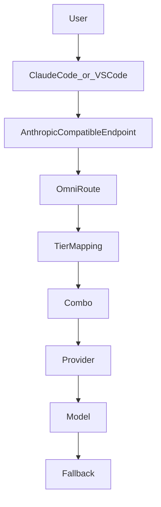

# Limitless Claude

[](LICENSE)

Claude Code + OmniRoute configuration that routes Opus, Sonnet, and Haiku workloads across verified provider/model fallbacks.

This repository is an installer, not an LLM gateway. It writes three OmniRoute combos and three model mappings, then merges gateway settings into Claude Code. Each user must connect their own provider credentials in OmniRoute.

## Architecture



Claude Code sends Anthropic Messages API traffic to `http://localhost:20128` with **no** `/v1` suffix. OmniRoute maps `*opus*`, `*sonnet*`, and `*haiku*` to combos. Each combo uses `strategy: "priority"`: models are tried in array order until one succeeds.

## Requirements

- Node.js 22 or newer (`node:sqlite` is built in; no npm packages are required)
- [OmniRoute](https://github.com/diegosouzapw/OmniRoute) 3.8.x, installed and started at least once
- [Claude Code](https://code.claude.com/docs/en/overview) CLI (and the VS Code extension if you use that surface)
- Provider credentials that **you** connect in the OmniRoute dashboard

Supported installer platforms: Windows, macOS, Linux. Windows startup auto-launch is optional.

## Installation

```bash
git clone https://github.com/mahik504/limitless-claude.git
cd limitless-claude
node setup.js
node validate.js
```

Start OmniRoute before `setup.js` if the database does not exist yet:

```bash
omniroute serve
```

Default database path:

- Windows: `%USERPROFILE%\.omniroute\storage.sqlite`
- macOS / Linux: `~/.omniroute/storage.sqlite`

Override with `OMNIROUTE_DB` (full sqlite path) or `DATA_DIR` (directory containing `storage.sqlite`).

`node setup.js` is idempotent. A second run updates the same combo and mapping IDs; it does not create duplicates.

## OmniRoute and provider setup

1. Open `http://localhost:20128`.
2. Sign in to the local OmniRoute dashboard.
3. Connect **OpenRouter**. The default combos need it.
4. Optionally connect **Kiro**, **Cloudflare Workers AI**, and **Groq**. Setup adds those models only when the provider is active.

OmniRoute documents that **Kiro's terms prohibit third-party proxy/harness use**. If Kiro is connected, Opus uses `kiro/glm-5` first and prints a warning. Review Kiro's terms before enabling it.

Create an OmniRoute API key in the dashboard and put it in Claude Code as `ANTHROPIC_AUTH_TOKEN`. Setup never overwrites a token that is already present.

## Combo configuration

Failover order is the list order below. Context and max-output numbers are **model limits** from the OpenRouter catalog (2026-09-21) unless noted. They are not provider usage quotas.

### Opus — coding (GLM first, then coding)

| Priority | Provider | Model ID | Free/paid | Context | Max output | Why |
| -------- | -------- | -------- | --------- | ------- | ---------- | --- |
| 1 | kiro | `glm-5` | Kiro plan credits | 200,000 (Kiro docs) | not published here | Your GLM quota first (if Kiro is connected) |
| 2 | openrouter | `z-ai/glm-5.2:free` | OpenRouter free (rate-limited) | 32,768 | 29,491 | OpenRouter GLM fallback |
| 3 | cloudflare-ai | `@cf/zai-org/glm-4.7-flash` | Cloudflare Neurons | 131,072 (Workers AI docs) | not published here | GLM-4.7-Flash on Workers Free |
| 4 | openrouter | `qwen/qwen3.8-27b:free` | OpenRouter free (rate-limited) | 262,144 | 235,929 | Coding / agent work |
| 5 | openrouter | `poolside/laguna-s-2.1:free` | OpenRouter free (rate-limited) | 262,144 | 32,768 | Coding-agent fallback |
| 6 | kiro | `qwen3-coder-next` | Kiro plan credits | 256,000 (Kiro docs) | not published here | Cheap Kiro coding leftover |

### Sonnet — reasoning

| Priority | Provider | Model ID | Free/paid | Context | Max output | Why |
| -------- | -------- | -------- | --------- | ------- | ---------- | --- |
| 1 | openrouter | `nvidia/nemotron-3-ultra-550b-a55b:free` | OpenRouter free (rate-limited) | 1,000,000 | 65,536 | Long-context reasoning |
| 2 | openrouter | `nvidia/nemotron-3-super-120b-a12b:free` | OpenRouter free (rate-limited) | 262,144 | 235,929 | Reasoning fallback |
| 3 | kiro | `deepseek-3.2` | Kiro plan credits | not published here | not published here | Optional if Kiro is connected |
| 4 | kiro | `claude-sonnet-5` | Kiro plan credits | not published here | not published here | Optional if Kiro is connected |

### Haiku — fast

| Priority | Provider | Model ID | Free/paid | Context | Max output | Why |
| -------- | -------- | -------- | --------- | ------- | ---------- | --- |
| 1 | openrouter | `nvidia/nemotron-3.5-lightning:free` | OpenRouter free (rate-limited) | 1,000,000 | 65,536 | Fast long-context replies |
| 2 | openrouter | `cohere/north-mini-code:free` | OpenRouter free (rate-limited) | 256,000 | 64,000 | Fast coding |
| 3 | groq | `openai/gpt-oss-120b` | Groq-plan priced | 131,072 | 65,536 | Optional if Groq is connected |

`z-ai/glm-5.3-flash` is **not** included: the OpenRouter catalog lists it as a paid slug, and `z-ai/glm-5.3-flash:free` was not present on 2026-09-21.

### Daily free use (documented)

This is **not** a guaranteed tokens-per-day pool. Providers publish requests, credits, or neurons. Context windows above are model limits, not usage quotas.

Opus and Haiku **share** the OpenRouter `:free` daily request counter. Using Haiku spends the same OpenRouter budget as Opus/Sonnet `:free` models.

| Surface | Documented free quota | Token estimate | Source |
| ------- | --------------------- | -------------- | ------ |
| OpenRouter `:free` (Opus GLM-5.2, Qwen, Laguna + Haiku Lightning/North Mini + Sonnet Nemotron) | 20 requests/minute. **50 requests/UTC-day** if lifetime credit purchases are under $10; **1,000 requests/UTC-day** after $10+ in credits. One account-wide counter. Failed attempts can still count. Upstream 429s still happen. | No published tokens/day. Illustration only: 50 turns × ~10k–40k tokens ≈ **0.5M–2M tokens/day** for the whole `:free` bucket, or **~10M–40M** on the 1,000 RPD tier. | [OpenRouter rate limits](https://openrouter.ai/docs/api-reference/limits) |
| Kiro Free (Opus `glm-5`, then `qwen3-coder-next`) | **50 credits per billing month**, not per day. GLM-5 is **0.5× vs Auto**. Credits are fractional per task. | No published tokens-per-credit. Naive split: ~1.6 credits/day if you spread 50 over 30 days — still credits, not tokens. | [Kiro billing](https://kiro.dev/docs/cli/billing/), [Kiro models](https://kiro.dev/docs/models/) |
| Cloudflare Workers AI (Opus `glm-4.7-flash`) | **10,000 Neurons/day** on Workers Free. GLM-4.7-Flash stays on Free; GLM-5.2/5.3 do not. | No official tokens/day. OmniRoute’s ~150 LLM responses/day is a heuristic. Listed price: $0.0605 / $0.40 per 1M input/output. | [Cloudflare Workers AI](https://developers.cloudflare.com/workers-ai/models/glm-4.7-flash/) |
| Haiku Groq `openai/gpt-oss-120b` | Not free. Groq developer plan listed $0.15 / $0.60 per 1M tokens, 250K TPM / 1K RPM. | Do not count as free. | Groq model docs |

Check remaining OpenRouter free-model requests with `GET https://openrouter.ai/api/v1/key`. These caps change. The installer does not guarantee remaining credits.

## Claude Code setup

Setup merges **only** these keys into `~/.claude/settings.json` (`%USERPROFILE%\.claude\settings.json` on Windows). Other keys are left alone. A timestamped backup is written first.

```json
{
  "env": {
    "ANTHROPIC_BASE_URL": "http://localhost:20128",
    "ANTHROPIC_AUTH_TOKEN": "your-omniroute-api-key",
    "CLAUDE_CODE_ENABLE_GATEWAY_MODEL_DISCOVERY": "1",
    "ANTHROPIC_DEFAULT_OPUS_MODEL": "claude-opus",
    "ANTHROPIC_DEFAULT_SONNET_MODEL": "claude-sonnet",
    "ANTHROPIC_DEFAULT_HAIKU_MODEL": "claude-haiku"
  }
}
```

Do not append `/v1` to `ANTHROPIC_BASE_URL`. Claude Code adds `/v1/messages`.

If Claude Code is already installed, setup does not uninstall it. It backs up the existing file, points the gateway at OmniRoute, and leaves unrelated settings in place.

Restart `claude` after setup. Confirm with `/status` that the base URL is localhost:20128.

### VS Code

The VS Code Claude Code extension reads gateway credentials from VS Code user settings, not only from `~/.claude/settings.json`. Add:

```json
{
  "claudeCode.environmentVariables": [
    { "name": "ANTHROPIC_BASE_URL", "value": "http://localhost:20128" },
    { "name": "ANTHROPIC_AUTH_TOKEN", "value": "your-omniroute-api-key" }
  ]
}
```

Open **Preferences: Open User Settings (JSON)** and merge those entries. Do not paste API keys into this repository.

## Verification

```bash
node validate.js
```

The script prints PASS / FAIL / WARN for Node.js, `node:sqlite`, OmniRoute CLI, endpoint health, database, schema, combos, mappings, model IDs, and Claude settings.

## Troubleshooting

**OmniRoute database not found**  
Start OmniRoute once so it creates `storage.sqlite`, then rerun setup.

**Database locked**  
Another process has the sqlite file. Wait, or stop OmniRoute, then retry.

**Schema mismatch**  
This installer targets OmniRoute 3.8.x tables `combos` and `model_combo_mappings`. Upgrade OmniRoute rather than editing sqlite by hand.

**There's an issue with the selected model**  
Confirm OmniRoute owns port 20128. Other Node apps sometimes bind that port if `PORT` is unset. Assign your app an explicit port (for example `npx next dev -p 3000`).

**Claude Code ignores the gateway**  
`ANTHROPIC_BASE_URL` must have no `/v1`. Restart Claude Code after changing settings.

**OpenRouter free model 429**  
Free endpoints are rate-limited. Wait, or connect another provider so OmniRoute can fail over.

**Kiro errors**  
Disconnect Kiro in OmniRoute if you do not want those optional fallbacks, then rerun `node setup.js`.

## Rollback / uninstall

```bash
node setup.js --rollback
```

Restores the newest Limitless Claude backup of the OmniRoute database files and `~/.claude/settings.json`. Stop OmniRoute first if restore reports the database is locked.

Windows startup launcher (optional, not installed by default):

```bash
node setup.js --install-startup
node setup.js --uninstall-startup
```

To stop using Limitless Claude without rollback: set `ANTHROPIC_BASE_URL` back to Anthropic or remove it, and delete combos `combo/claude-opus`, `combo/claude-sonnet`, `combo/claude-haiku` in the OmniRoute dashboard if you no longer want them.

## Security

- Setup copies sqlite and Claude settings into timestamped folders under `~/.omniroute/backups/` and `~/.claude/backups/`. Those files can contain credentials. Do not commit them.
- Do not put OmniRoute keys, OpenRouter keys, or `.env` files in git.
- The gateway in this design is `localhost`. Do not expose port 20128 to the public internet without understanding OmniRoute auth.
- This installer does not collect telemetry.

## Limitations

- OpenRouter `:free` availability and rate limits change. A model ID that worked today can return 429 or disappear.
- Setup cannot create provider credentials. If OpenRouter is not connected, combos cannot be built.
- Kiro fallbacks depend on your Kiro account and may conflict with Kiro's terms.
- Groq `openai/gpt-oss-120b` is not an OpenRouter free model.
- This project does not make Claude Code or OmniRoute themselves. Bugs in those products are upstream.
- VS Code extension settings are documented, not written automatically.

## Contribution

Open a pull request with a verified provider/model ID (link the current catalog page), a short reason the fallback is useful, and `node setup.js` + `node validate.js` output with secrets removed. Keep the three-tier layout. Do not add unpaid or guessed model names.

## License

MIT. Copyright (c) 2026 mahik504.
