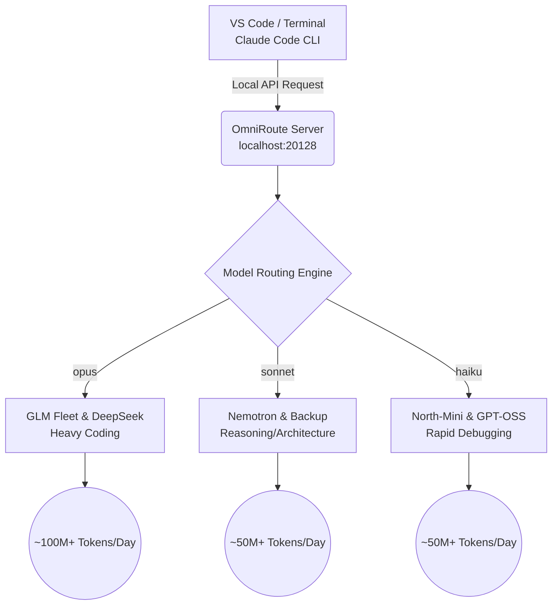

# 🚀 Limitless Claude

> Transform your terminal and VS Code into an enterprise-grade, autonomous AI software engineer—completely free of API costs.

Limitless Claude bypasses expensive Anthropic API subscriptions by hooking your local Claude Code environment into a load-balanced, free-tier fleet of the world's most powerful open-weights and frontier models via OmniRoute.

---

## 🏗️ Architecture Overview

## 🧠 The Three Fleets

### 1. OPUS TIER: The Elite Coding Fleet
When you ask Claude Code for `opus`, it routes to a heavy-duty algorithmic coding fleet. 
* **The Priority:** Chinese frontier GLM models (**GLM-5**, **GLM-5.3-Flash**, **GLM-5.2**) are prioritized for complex logic. 
* **The Backup:** Cascades to **DeepSeek V3.2**, **Qwen3-Coder-Next**, and **Claude Sonnet 5**.
* **Daily Capacity:** ~100M+ tokens.

### 2. SONNET TIER: Architecture & Reasoning
When you select `sonnet`, you get pure reasoning and high-level project planning. 
* **Top Models:** **NVIDIA Nemotron-3 Super (120B)**, **NVIDIA Nemotron-3 Ultra (550B)**.
* **Note:** We explicitly strip `<think>` tags via system prompts to ensure terminal output remains clean.
* **Daily Capacity:** ~50M+ tokens.

### 3. HAIKU TIER: Ultra-Fast
Built for rapid-fire answers, syntax checking, and basic debugging.
* **Top Models:** **Cohere North-Mini-Code**, **GPT-OSS-120B**.
* **Daily Capacity:** ~50M+ tokens.

---

## 🛠️ Option 1: Standard Installation (Raw Claude Code)

This setup requires **15 minutes of one-time manual configuration** to get your free API keys. After that, it is fully automated.

### 1. Prerequisites
* [Node.js](https://nodejs.org/)
* [Claude Code CLI](https://docs.anthropic.com/en/docs/agents-and-tools/claude-code/overview) (Run: `npm install -g @anthropic-ai/claude-code`)
* OmniRoute (running locally on `http://localhost:20128`)

### 2. Configure Providers (Crucial)
Open your OmniRoute dashboard at `http://localhost:20128`. Create accounts and configure free-tier API keys for:
`kiro`, `cloudflare-ai`, `openrouter`, `groq`, `bluesminds`

### 3. Autonomous Setup
Once your keys are active, feed this repository link to your AI assistant (Cursor, Antigravity, or Claude) and paste this exact prompt:
> "I have configured my OmniRoute providers. Clone `https://github.com/mahik504/limitless-claude.git`, `cd` into it, run `npm install better-sqlite3`, and then execute `node setup.js`."

**What the script does automatically:**
1. Injects the precise Model Combos and strict System Messages into OmniRoute.
2. Hardwires your `~/.claude/settings.json` to bypass validation errors.
3. Drops a safe VBScript into your Windows Startup folder so OmniRoute boots silently in the background every time you turn on your laptop.

---

## 🌐 Option 2: Orchestra Workflow 3.10 Integration (Advanced)

If you want to push Claude Code beyond raw coding and turn it into a Staff Engineer that manages full-stack architecture, you need the **Orchestra Workflow 3.10**. 

Integrating Orchestra injects a Control Plane into Claude Code, giving it a permanent Obsidian Brain (memory), professional UI/UX skills (Emil Design, Taste Design), and custom MCP servers (Playwright, Stripe, GitHub).

### How to Integrate Orchestra into Claude Code:
1. Ensure the Standard Installation (Option 1) is fully working.
2. Clone the Orchestra Workflow repository to your machine (e.g., `C:\projects\orchestra-workflow`).
3. Feed this prompt to your AI assistant to wire it up:
> "I want to upgrade Claude Code with Orchestra Workflow 3.10. Please add the Orchestra Brain MCP server to my `~/.claude/.mcp.json` file. Then, copy the core Orchestra routing skills (`orchestra-conductor`, `taste-design`, `impeccable`) from `C:\projects\orchestra-workflow\skills` into `~/.claude/skills/`. Finally, update VS Code settings to `"editor.formatOnSave": true` and `"files.autoSaveDelay": 1000` to prevent file conflicts."

Once complete, Claude Code will actively use the **Conductor Loop** to research, design, build, test, and commit your applications autonomously.

---

## ⚠️ Troubleshooting & Common Errors

**Error: "There's an issue with the selected model..."**
If you ever see this error in Claude Code, it means another application has hijacked OmniRoute's port (20128).
* **Why it happens:** Web frameworks (Next.js, React) aggressively search for open ports or read the global `PORT` variable. If started incorrectly, they will bind to `20128`, blocking Claude Code.
* **The Fix:** Always explicitly assign ports to your web servers (e.g., `npx next dev -p 3000`). If port 20128 gets hijacked, kill the rogue Node.js process to restore OmniRoute.

---

## 📞 Support
If you encounter any issues while setting this up, feel free to reach out.
**Email:** `gehlot.mahisingh2006.102@gmail.com`

*Built by mahik504. Released under the MIT License.*
