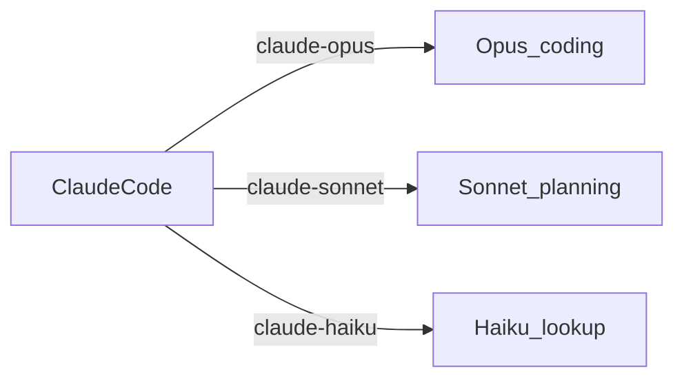

# Limitless Claude

[](LICENSE)

Point Claude Code at local OmniRoute and get three jobs: **Opus** for coding, **Sonnet** for plans and docs, **Haiku** for short lookups. Each job is a fallback combo. The first model that answers wins.

This repository is an installer, not an LLM gateway, and not Anthropic Claude. You connect your own provider keys in OmniRoute. Setup writes the combos; extra `:free` names do not multiply OpenRouter's daily request counter.

## Architecture



Claude Code sends Anthropic Messages API traffic to `http://localhost:20128` with **no** `/v1` suffix. OmniRoute maps `*opus*`, `*sonnet*`, and `*haiku*` to combos. Each combo uses `strategy: "priority"`: models are tried in array order until one succeeds.

## Requirements

- Node.js 22 or newer (`node:sqlite` is built in; no npm packages are required)
- [OmniRoute](https://github.com/diegosouzapw/OmniRoute) 3.8.x, installed and started at least once
- [Claude Code](https://code.claude.com/docs/en/overview) CLI (and the VS Code extension if you use that surface)
- Provider credentials that **you** connect in the OmniRoute dashboard

Supported installer platforms: Windows, macOS, Linux. Windows startup auto-launch is optional.

## Installation

There are **no npm dependencies**. Do not run `npm install`, and do not install `better-sqlite3`. Setup uses Node's built-in `node:sqlite`.

```bash
node --version
npm install -g omniroute
omniroute serve
```

Leave that server running. Open `http://localhost:20128`, connect **OpenRouter** (required), create an OmniRoute API key, then:

```bash
git clone https://github.com/mahik504/limitless-claude.git
cd limitless-claude
node setup.js
node validate.js
```

If you already cloned an older commit, `git pull` and run `node setup.js` again. That replaces the old combo lists.

`omniroute serve` must be running at least once before setup, so the database exists. Port **20128** has to be OmniRoute. Do not point Next.js or Vite at that port.

Default database path:

- Windows: `%USERPROFILE%\.omniroute\storage.sqlite`
- macOS / Linux: `~/.omniroute/storage.sqlite`

Override with `OMNIROUTE_DB` (full sqlite path) or `DATA_DIR` (directory containing `storage.sqlite`).

`node setup.js` is idempotent. A second run updates the same combo and mapping IDs; it does not create duplicates.

## Providers to connect

Open **http://localhost:20128**, sign in, then connect:

| Provider | Needed for | Notes |
| -------- | ---------- | ----- |
| **OpenRouter** | All three combos | Required. Setup cannot build the combos without it. |
| Antigravity | Opus Flash / Gemini 3.1 Pro, Sonnet Claude, Haiku Flash Lite | Optional. OAuth in the OmniRoute dashboard. |
| Cloudflare Workers AI | Opus GLM-4.7-Flash and Qwen Coder | Optional. 10,000 Neurons/day on Workers Free. |
| Kiro | Opus `glm-5` first | Optional. OmniRoute documents that Kiro's terms prohibit third-party proxy use. |
| NVIDIA NIM | Sonnet Nemotron Super | Optional. Separate from OpenRouter. |
| Groq | Haiku speed path | Optional. `openai/gpt-oss-20b` is priced. |
| Kilo gateway | Opus Laguna on a second gateway | Optional. |

A clone with **only OpenRouter** still installs. Optional models are skipped when that provider is off.

Create an OmniRoute API key in the dashboard and put it in Claude Code as `ANTHROPIC_AUTH_TOKEN`. Setup never overwrites a token that is already present.

Leave these off the combos until they answer with tools: `qwen-web`, `zai-web` (no caller tool calls), `kimi-coding` (403 without a Kimi Code plan), NVIDIA `z-ai/glm-5.2` (410, end of life), the separate `gemini` / `cerebras` / `deepseek` keys while they are switched off.

## Combo configuration

Failover order is the list order below. A model is added only when that provider is connected. Catalog-gated OpenRouter and NVIDIA rows are skipped if they disappear from OmniRoute's sync.

### Opus — code, debug, tests, agents

GLM first. Later rows are other pools so a 429 on OpenRouter does not end the day.

| Priority | Provider | Model ID | Pool |
| -------- | -------- | -------- | ---- |
| 1 | kiro | `glm-5` | Kiro credits |
| 2 | cloudflare-ai | `@cf/zai-org/glm-4.7-flash` | Cloudflare Neurons |
| 3 | cloudflare-ai | `@cf/qwen/qwen2.5-coder-32b-instruct` | Same Neuron pool |
| 4 | antigravity | `gemini-3.7-flash-high` | Antigravity Gemini |
| 5 | antigravity | `gemini-pro-agent` | Same window (Gemini 3.1 Pro High) |
| 6 | antigravity | `gemini-3.8-flash-tiered` | Same window |
| 7 | nvidia | `nvidia/nemotron-3-super-120b-a12b` | NVIDIA NIM (separate from OpenRouter) |
| 8 | openrouter | `z-ai/glm-5.2:free` | Shared OpenRouter `:free` counter |
| 9 | openrouter | `poolside/laguna-s-2.1:free` | Same OpenRouter counter |
| 10 | kilo-gateway | `poolside/laguna-s-2.1:free` | Kilo gateway |
| 11 | kiro | `qwen3-coder-next` | Same Kiro credits |

### Sonnet — plans, architecture, PRDs, design docs

Short quality chain. Kiro stays off this combo so remaining credits stay on Opus GLM.

| Priority | Provider | Model ID | Pool |
| -------- | -------- | -------- | ---- |
| 1 | antigravity | `claude-opus-4-6-thinking` | Antigravity Claude/GPT weekly window |
| 2 | antigravity | `claude-sonnet-4-6` | Same window |
| 3 | antigravity | `gemini-pro-agent` | Antigravity Gemini |
| 4 | nvidia | `nvidia/nemotron-3-super-120b-a12b` | NVIDIA NIM |
| 5 | openrouter | `nvidia/nemotron-3-ultra-550b-a55b:free` | Shared OpenRouter `:free` counter (required so an OpenRouter-only clone still installs) |

### Haiku — search, fact check, short answers

Fastest measured first.

| Priority | Provider | Model ID | Pool |
| -------- | -------- | -------- | ---- |
| 1 | groq | `openai/gpt-oss-20b` | Groq plan (priced) |
| 2 | antigravity | `gemini-3.1-flash-lite` | Antigravity Gemini |
| 3 | openrouter | `nvidia/nemotron-3.5-lightning:free` | Shared OpenRouter `:free` counter |

## What “free tokens” actually is

Providers publish **requests, credits, or neurons**. Extra model names on the same OpenRouter account do not add a second daily bucket. Opus, Sonnet, and Haiku `:free` rows share one counter.

| Surface | Documented quota | Honest token picture |
| ------- | ---------------- | -------------------- |
| OpenRouter `:free` | 20 req/min. **50 requests/UTC-day** under 10 purchased credits; **1,000/UTC-day** after at least 10 credits purchased. | No published tokens/day. Illustration only: 50 turns × ~10k–40k tokens ≈ **0.5M–2M/day** for the whole bucket, or **~10M–40M** on the 1,000-request tier. |
| Kiro Free | **50 credits/month**. GLM-5 is 0.5× vs Auto. | No tokens-per-credit formula. |
| Cloudflare Workers Free | **10,000 Neurons/day**. Opus GLM-Flash and Qwen Coder share it. | No official tokens/day. |
| Antigravity | Your account windows, separate from OpenRouter. | No published tokens/day. |
| NVIDIA NIM | Your NVIDIA key. | Separate from OpenRouter `:free`. |
| Groq `gpt-oss-20b` | Priced. | Do not count as free. |

Check remaining OpenRouter free-model requests with `GET https://openrouter.ai/api/v1/key`. These caps change. The installer does not guarantee remaining credits.

## Claude Code setup

Setup merges **only** these keys into `~/.claude/settings.json` (`%USERPROFILE%\.claude\settings.json` on Windows). Other keys are left alone. A timestamped backup is written first.

```json
{
  "env": {
    "ANTHROPIC_BASE_URL": "http://localhost:20128",
    "ANTHROPIC_AUTH_TOKEN": "your-omniroute-api-key",
    "CLAUDE_CODE_ENABLE_GATEWAY_MODEL_DISCOVERY": "1",
    "ANTHROPIC_DEFAULT_OPUS_MODEL": "claude-opus",
    "ANTHROPIC_DEFAULT_SONNET_MODEL": "claude-sonnet",
    "ANTHROPIC_DEFAULT_HAIKU_MODEL": "claude-haiku"
  }
}
```

Do not append `/v1` to `ANTHROPIC_BASE_URL`. Claude Code adds `/v1/messages`.

If Claude Code is already installed, setup does not uninstall it. It backs up the existing file, points the gateway at OmniRoute, and leaves unrelated settings in place.

Restart `claude` after setup. Confirm with `/status` that the base URL is localhost:20128.

### VS Code

Setup writes `claudeCode.environmentVariables` into VS Code user settings when that file exists and is plain JSON, and when `ANTHROPIC_AUTH_TOKEN` is already in `~/.claude/settings.json`. If the file has comments, setup leaves it alone.

Otherwise add:

```json
{
  "claudeCode.environmentVariables": [
    { "name": "ANTHROPIC_BASE_URL", "value": "http://localhost:20128" },
    { "name": "ANTHROPIC_AUTH_TOKEN", "value": "your-omniroute-api-key" }
  ]
}
```

Open **Preferences: Open User Settings (JSON)** and merge those entries. Do not paste API keys into this repository.

## Verification

```bash
node validate.js
```

The script prints PASS / FAIL / WARN for Node.js, `node:sqlite`, OmniRoute CLI, endpoint health, database, schema, combos, mappings, model IDs, and Claude settings.

## Troubleshooting

**OmniRoute database not found**  
Start OmniRoute once so it creates `storage.sqlite`, then rerun setup.

**Database locked**  
Another process has the sqlite file. Wait, or stop OmniRoute, then retry.

**Schema mismatch**  
This installer targets OmniRoute 3.8.x tables `combos` and `model_combo_mappings`. Upgrade OmniRoute rather than editing sqlite by hand.

**There's an issue with the selected model**  
Confirm OmniRoute owns port 20128. Other Node apps sometimes bind that port if `PORT` is unset. Assign your app an explicit port (for example `npx next dev -p 3000`).

**Claude Code ignores the gateway**  
`ANTHROPIC_BASE_URL` must have no `/v1`. Restart Claude Code after changing settings.

**OpenRouter free model 429**  
Free endpoints are rate-limited. Wait, or connect another provider so OmniRoute can fail over.

**Kiro errors**  
Disconnect Kiro in OmniRoute if you do not want those optional fallbacks, then rerun `node setup.js`.

## Rollback / uninstall

```bash
node setup.js --rollback
```

Restores the newest Limitless Claude backup of the OmniRoute database files and `~/.claude/settings.json`. Stop OmniRoute first if restore reports the database is locked.

Windows startup launcher (optional, not installed by default):

```bash
node setup.js --install-startup
node setup.js --uninstall-startup
```

To stop using Limitless Claude without rollback: set `ANTHROPIC_BASE_URL` back to Anthropic or remove it, and delete combos `combo/claude-opus`, `combo/claude-sonnet`, `combo/claude-haiku` in the OmniRoute dashboard if you no longer want them.

## Security

- Setup copies sqlite and Claude settings into timestamped folders under `~/.omniroute/backups/` and `~/.claude/backups/`. Those files can contain credentials. Do not commit them.
- Do not put OmniRoute keys, OpenRouter keys, or `.env` files in git.
- The gateway in this design is `localhost`. Do not expose port 20128 to the public internet without understanding OmniRoute auth.
- This installer does not collect telemetry.

## Limitations

- OpenRouter `:free` availability and rate limits change. A model ID that worked today can return 429 or disappear.
- Setup cannot create provider credentials. If OpenRouter is not connected, combos cannot be built.
- Kiro fallbacks depend on your Kiro account and may conflict with Kiro's terms.
- Groq `openai/gpt-oss-20b` is priced. It is the Haiku speed path, not a free model.
- `qwen-web` and `zai-web` do not accept caller tool calls, so they are not in the combos.
- This project does not make Claude Code or OmniRoute themselves. Bugs in those products are upstream.
- VS Code settings are updated when `%APPDATA%\Code\User\settings.json` (or the macOS/Linux equivalent) is plain JSON and the OmniRoute token is already in Claude settings. Files with comments are left unchanged.

## Contribution

Open a pull request with a verified provider/model ID (link the current catalog page), a short reason the fallback is useful, and `node setup.js` + `node validate.js` output with secrets removed. Keep the three-tier layout. Do not add unpaid or guessed model names.

## License

MIT. Copyright (c) 2026 mahik504.
