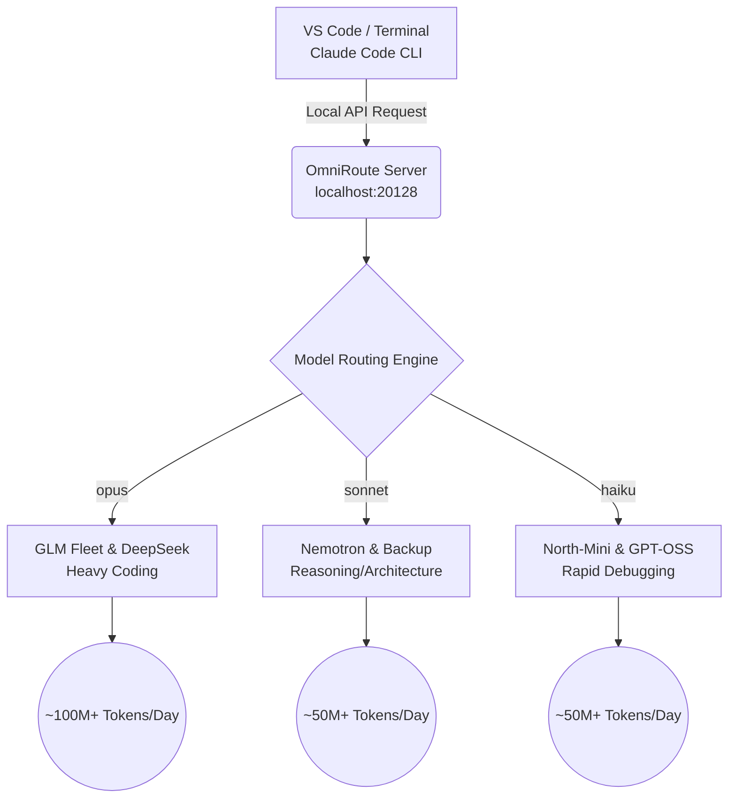

# 🚀 Limitless Claude

> Transform your terminal and VS Code into an enterprise-grade, autonomous AI software engineer—completely free of API costs.

Limitless Claude bypasses expensive Anthropic API subscriptions by hooking your local Claude Code environment into a load-balanced, free-tier fleet of the world's most powerful open-weights and frontier models via OmniRoute. 

Your data stays secure: the local routing server runs continuously in the background, is strictly locked to your `localhost`, and cannot be accessed externally. It runs flawlessly in the CLI and VS Code extension without throwing errors.

---

## 🏗️ Architecture Overview

## 🧠 The Three Fleets

### 1. OPUS TIER: The Absolute Best Coding Fleet
When you ask Claude Code for `opus`, it routes to a heavy-duty algorithmic coding fleet. 
* **The Priority:** Chinese frontier GLM models (**GLM-5**, **GLM-5.3-Flash**, **GLM-5.2**) are prioritized for complex logic. 
* **The Backup:** Cascades to **DeepSeek V3.2**, **Qwen3-Coder-Next**, and **Claude Sonnet 5**.
* **Daily Capacity:** ~100M+ tokens.

### 2. SONNET TIER: Reasoning & Architecture
When you select `sonnet`, you get the absolute best reasoning and high-level project planning models. 
* **Top Models:** **NVIDIA Nemotron-3 Super (120B)**, **NVIDIA Nemotron-3 Ultra (550B)**.
* **Note:** We explicitly strip `<think>` tags via system prompts to ensure terminal output remains clean.
* **Daily Capacity:** ~50M+ tokens.

### 3. HAIKU TIER: Ultra-Fast Response
Built for rapid-fire answers, syntax checking, and basic debugging.
* **Top Models:** **Cohere North-Mini-Code**, **GPT-OSS-120B**.
* **Daily Capacity:** ~50M+ tokens.

---

## 🛠️ Step 1: Standard Installation (Raw Claude Code)

### 1. Prerequisites
* [Node.js](https://nodejs.org/)
* [Claude Code CLI](https://docs.anthropic.com/en/docs/agents-and-tools/claude-code/overview) (Run: `npm install -g @anthropic-ai/claude-code`)
* OmniRoute (running locally on `http://localhost:20128`)

### 2. Configure Your Free APIs (Manual Step)
The routing server starts automatically when you boot your laptop. Before running the setup script, you must authenticate your free API providers:
1. Open `http://localhost:20128` in your browser.
2. Sign in via Google Auth (this is entirely local and secure).
3. Connect and configure keys for these exact providers: **`kiro`, `cloudflare-ai`, `openrouter`, `groq`, and `bluesminds`**.

### 3. Automate the Configuration
Once your providers are connected, ask your AI assistant (Cursor, Antigravity, or Claude) to finalize the setup. Feed it this exact prompt:

> "I have cloned the Limitless Claude repository and connected all my providers. Please run `npm install better-sqlite3` and then execute `node setup.js`. After that, I am ready to code."

**What the script does automatically:**
* Injects the optimized combos and strict System Messages into your local database.
* Hardwires your `~/.claude/settings.json` to bypass validation errors.
* Ensures flawless execution in both VS Code and your terminal.

*(At this point, your free setup is fully complete and ready to use! If you want to take it a step further, see Step 2).*

---

## 🌐 Step 2: Orchestra Workflow 3.10 Integration (Optional Upgrade)

Raw Claude Code is a brilliant coder. But if you want it to act like a Staff Engineer that manages full-stack architecture, you need the **Orchestra Workflow 3.10**. 

### Why do you need this? 
Integrating Orchestra injects a Control Plane into Claude Code. Without it, the AI defaults to generic, boilerplate UI (like basic Tailwind). *With* Orchestra, it gains:
1. **Permanent Memory (Obsidian Brain):** It remembers your preferences, project rules, and previous mistakes across reboots.
2. **Professional UI/UX Skills:** Access to strict typography, animations, and premium layout standards via `taste-design` and `emil-design-eng`.
3. **MCP Backend Server Capabilities:** It can autonomously open browsers to test its own code (Playwright), extract design systems (Stitch), and manage databases.

### How to Integrate:
If you want these improvements, clone the Orchestra Workflow 3.10 repository to your machine, then feed this prompt to your AI assistant:

> "I want to upgrade Claude Code with Orchestra Workflow 3.10. Please add the Orchestra Brain MCP server to my `~/.claude/.mcp.json` file. Then, copy the core Orchestra routing skills (`orchestra-conductor`, `taste-design`, `impeccable`) from the Orchestra repository into `~/.claude/skills/`. Finally, update my VS Code settings to `"editor.formatOnSave": true` and `"files.autoSaveDelay": 1000` to prevent file conflicts."

---

## 🤝 Open Source Contributions

This project is built for the community. If you are testing this out, your contributions are highly welcome!
* **API Providers:** Found a new provider offering high-tier free limits? Open a PR to add it to the combo mapping!
* **Model Combos:** Have a better cascading logic for the Opus or Sonnet tiers? Share your routing setups.
* **Orchestra Skills:** If you write custom skills, prompts, or MCP integrations for the Orchestra workflow, contribute them so others can improve their AI's output. 

Fork the repo, test it out, and submit a Pull Request! 

---

## ⚠️ Troubleshooting & Common Errors

**Error: "There's an issue with the selected model..."**
If you ever see this error in Claude Code, it means another application has hijacked OmniRoute's port (20128).
* **Why it happens:** Web frameworks (Next.js, React) aggressively search for open ports or read the global `PORT` variable. If started incorrectly, they will bind to `20128`, blocking Claude Code.
* **The Fix:** Always explicitly assign ports to your web servers (e.g., `npx next dev -p 3000`). If port 20128 gets hijacked, kill the rogue Node.js process to restore OmniRoute.

---

## 📞 Support
If you encounter any issues while setting this up, feel free to reach out.
**Email:** `gehlot.mahisingh2006.102@gmail.com`

*Built by mahik504. Released under the MIT License.*
