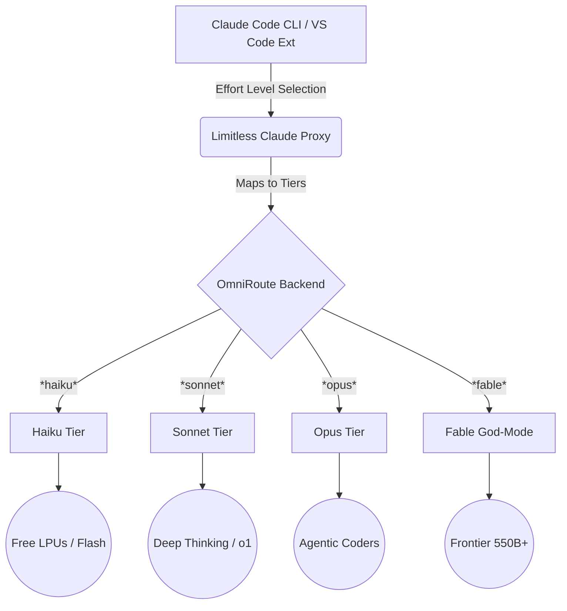

# Limitless Claude 🚀

**Supercharge your Claude Code CLI and VS Code Extension with unlimited, god-tier AI models.**

Limitless Claude is an advanced proxy, mapping, and orchestration layer designed to completely unlock your Claude Code environment. Instead of being restricted to limited official models, Limitless Claude dynamically bridges Claude Code to the **OmniRoute** backend, giving you instant access to the greatest frontier models on the planet—entirely for free, or perfectly balanced with your paid API keys.

---

## 🌟 The Architecture: The 4 God-Tiers

Limitless Claude cleanly bypasses the cluttered UI of 170+ confusing models and organizes your capabilities into four flawlessly benchmarked, auto-cascading tiers. 

### 1. ⚡ Haiku Tier (Flash Speed)
*Best for: Rapid codebase searches, short answers, syntax fixes, and instant CLI tools.*
Strictly prioritizing Time-to-First-Token (TTFT) using LPUs and wafer-scale hardware. Expect sub-second response times using completely free endpoints like Groq (Llama 3.1 8B), Gemini 2.0 Flash, and Nemotron Lightning. 

### 2. 🧠 Sonnet Tier (Reasoning & Architecture)
*Best for: System design, architecture planning, complex math, and deep logical reasoning.*
Strictly benchmarked for GPQA and logic. Uses internal `<thinking>` models like GitHub Copilot's `o1-preview`, Antigravity's `claude-opus-4.6-thinking`, and free reasoning champions like DeepSeek Reasoner. 

### 3. 💻 Opus Tier (Agentic Coding Frontier)
*Best for: Massive codebase refactors, debugging, test generation, and autonomous agents.*
Prioritizes extreme context and coding capability while fiercely protecting your paid usage limits. We exhaust massive free daily quotas from AgentRouter (`claude-opus-5`), Ollama Cloud (`glm-5.3`), and Mistral *before* safely cascading down to Antigravity Pro agents if needed.

### 4. 👑 Fable Tier (GOD MODE)
*Best for: The impossible.*
When API limits do not matter. We throw the absolute heaviest, most intelligent models on the planet at your prompt. This tier ignores token costs and unleashes pure power: Aider's #1 (`claude-sonnet-5`), LMSYS #1 (`claude-opus-4.6-thinking`), and raw 550B parameter behemoths.

---

## 🛠️ System Architecture



---

## 🚀 Key Features

- **Total 403 API Error Bypass:** No more "Limitless Opus Tier is not allowed for this API key". We actively patch the OmniRoute backend restrictions to ensure your wildcard tokens work flawlessly.
- **Effort-Level Native:** Claude Code's native UI effort slider (Low, Medium, High, Ultra) perfectly routes to your desired capability tiers under the hood.
- **Rate-Limit Invulnerability:** If a model hits a cap or throws a 402, the proxy instantly cascades to the next best model in ~15 milliseconds. You will never see a timeout.
- **Pristine UI:** Say goodbye to endless scrolling. Your Claude Code model dropdown will only show exactly what you need.

## 📦 Installation & Setup

1. **Clone the repository:**
   ```bash
   git clone https://github.com/your-username/limitless-claude.git
   cd limitless-claude
   ```

2. **Install Dependencies:**
   ```bash
   npm install
   ```

3. **Run the Injector:**
   ```bash
   npm run setup
   ```
   *This automatically connects to your local OmniRoute instance, writes the god-tier combo tables, restricts messy API keys, and securely syncs your `~/.claude/settings.json`.*

4. **Verify the Connection:**
   ```bash
   node validate.js
   ```

5. **Code Like A God:**
   Open the Claude Code extension in VS Code. You will instantly see your new, clean Limitless Tiers ready for action!
