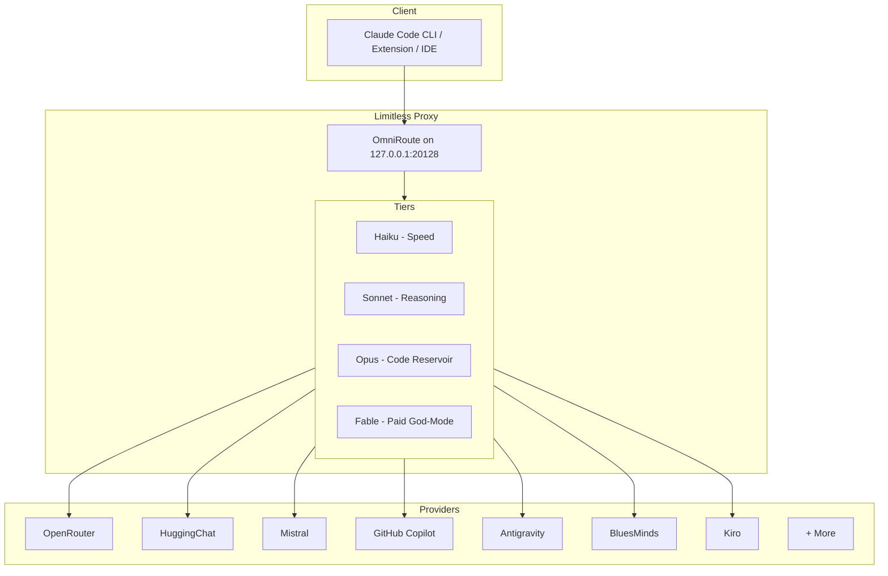

# Limitless Claude v4.4.1

Limitless Claude is an experimental routing wrapper designed to map various third-party models onto Claude Code's internal aliases (`haiku`, `sonnet`, `opus`). It leverages **OmniRoute** to distribute traffic across a dynamic pool of models from providers like OpenRouter, HuggingChat, Kiro, and GitHub Copilot.

---

## ⚠️ Important Limitations and Realities
- **No Token Guarantees:** This architecture routes to third-party providers. There are no "guaranteed" daily token volumes. Rate limits, timeouts, and API disruptions will occur based on the providers you connect.
- **Not 100% Native:** While the routing tries to align models by capability (Speed vs. Reasoning), third-party models (e.g., DeepSeek, Qwen) do not behave exactly like native Anthropic models. Complex `claude say` commands or specific Multi-Agent tool interactions may occasionally fail or require retry.
- **Provider Requirements:** You must independently manage, authenticate, and monitor limits on your upstream providers.
- **No Rate Limit Immunity:** Load-balancing (Round-Robin) helps distribute requests across APIs, but it does *not* bypass provider-level quotas or IP bans. 

---

## Architecture


```mermaid
flowchart TD
    subgraph Client
        CC[Claude Code CLI / Extension / IDE]
    end

    subgraph Limitless Proxy
        OR[OmniRoute on 127.0.0.1:20128]
        subgraph Tiers
            H[Haiku - Speed]
            S[Sonnet - Reasoning]
            O[Opus - Code Reservoir]
            F[Fable - Paid God-Mode]
        end
    end

    subgraph Providers
        P1[OpenRouter]
        P2[HuggingChat]
        P3[Mistral]
        P4[GitHub Copilot]
        P5[Antigravity]
        P6[BluesMinds]
        P7[Kiro]
        P8[+ More]
    end

    CC --> OR
    OR --> Tiers
    Tiers --> P1
    Tiers --> P2
    Tiers --> P3
    Tiers --> P4
    Tiers --> P5
    Tiers --> P6
    Tiers --> P7
```

---

## The Four Tiers & Configured Models

To manage traffic, **Opus** and **Fable** utilize a **Round-Robin** load-balancing strategy, meaning requests rotate sequentially across available models. **Haiku** and **Sonnet** use a strict **Priority** cascade for latency optimization.

*(Note: The setup script filters this list dynamically. Models will only be active if your OmniRoute server detects a valid, authenticated provider for them).*

### Haiku — Speed
Intended for rapid lookups and low-latency edits. (Priority Cascade)
1. `github/gpt-4o-mini`
2. `antigravity/gemini-3.1-flash-lite`
3. `kiro/qwen3-coder-next`
4. `groq/llama-3.1-8b-instant`
5. `openrouter/z-ai/glm-5.2:free`
6. `openrouter/qwen/qwen3.8-27b:free`
7. `openrouter/nvidia/nemotron-3.5-lightning:free`

### Sonnet — Reasoning
Intended for system design, architecture planning, and chain-of-thought reasoning. (Priority Cascade)
1. `antigravity/claude-sonnet-4-6`
2. `bluesminds/deepseek-reasoner`
3. `antigravity/claude-opus-4-6-thinking`
4. `github/gpt-4o-2024-11-20`
5. `kiro/glm-5`
6. `huggingchat/CohereLabs/command-a-reasoning-08-2025`

### Opus — Code Reservoir
A large pool of fallback models for intensive generation. (Round-Robin)
1. `kiro/qwen3-coder-next`
2. `mistral/codestral-latest`
3. `kiro/deepseek-3.2`
4. `openrouter/z-ai/glm-5.2:free`
5. `openrouter/qwen/qwen3.8-27b:free`
6. `openrouter/poolside/laguna-s-2.1:free`
7. `bluesminds/gpt-5.5`
8. `ollama-cloud/glm-5.3`
9. `bluesminds/kimi-k3`
10. `kiro/glm-5`
11. `openrouter/liquid/lfm-2.5-2.6b:free`
12. `huggingchat/deepseek-ai/DeepSeek-V4-Pro`
13. `huggingchat/Qwen/Qwen3.6-27B`
14. `opencode/deepseek-v4-flash-free`
15. `opencode/big-pickle`
16. `muse-spark-web/muse-spark-thinking`
17. `muse-spark-web/muse-spark`

### Fable — Premium
Reserved for advanced APIs. (Round-Robin)
1. `github/gpt-4o-2024-11-20`
2. `antigravity/claude-opus-4-6-thinking`
3. `antigravity/gemini-3.1-pro-low`
4. `openrouter/moonshotai/kimi-k3`
5. `openrouter/z-ai/glm-5.3`
6. `openrouter/qwen/qwen-3.8-coder-32b-instruct`

---

## Installation

**Prerequisites:**
- Node.js v22 or later
- `pnpm` installed globally
- Claude Code installed (`npm install -g @anthropic-ai/claude-code`)

### Step 1 — Install and start OmniRoute

```bash
pnpm add -g omniroute@latest
omniroute serve
```

### Step 2 — Connect your providers

Open `http://localhost:20128` in your browser and authenticate your chosen providers (e.g., OpenRouter, HuggingChat, GitHub Copilot).

### Step 3 — Build the tiers

```bash
git clone https://github.com/mahik504/limitless-claude.git
cd limitless-claude
npm install
npm run setup
```

The setup script will:
1. Query your live OmniRoute instance for authenticated models. (If OmniRoute is offline, it will fall back to a cached inventory file and warn you).
2. Write the four tiers into the local `storage.sqlite` database using SQL transactions.
3. Overwrite the default API Key access to allow the `combo/*` routes.
4. On Windows, attempt to install a silent `Limitless-OmniRoute-Launcher.vbs` script in your Startup folder to auto-boot OmniRoute on login.

### Step 4 — Automated Testing

To verify your configuration logic and payload structure without modifying your database, run the built-in test suite:

```bash
npm test
```

### Step 5 — Use Claude Code

```bash
claude
```

## Rollback & Recovery

If the setup script fails, it is designed to roll back its changes to the SQLite database. A backup is automatically created at `~/.omniroute/storage.sqlite.bak`.
If you wish to remove the automatic startup script on Windows, manually delete `Limitless-OmniRoute-Launcher.vbs` from your `AppData\Roaming\Microsoft\Windows\Start Menu\Programs\Startup` folder.

---

## License
MIT
