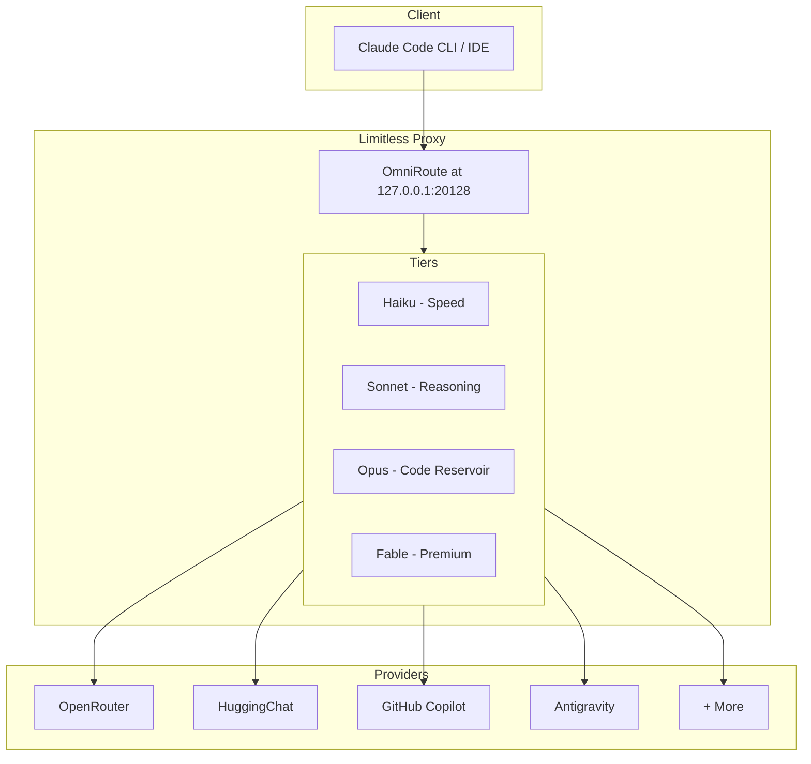

# Limitless Claude 

**Your Coding Agent. Your Model Fleet. Your Rules.**

Limitless Claude is an open-source, student-friendly model-routing harness designed to wrap **Claude Code** and **OmniRoute**. It allows you to ditch expensive, single-vendor API bills and instead route your agentic coding workflows through a massive fleet of free, subscription-entitled, and open-weight AI models. 

By combining provider access, dynamic model selection, custom internal tier personas, and intelligent fallback pools into one local workflow, this project unlocks an **estimated aggregate capacity of up to ~28 Million tokens per day**.

[Architecture](#architecture) • [Tiers](#the-four-tiers) • [Token Estimates](#the-token-capacity-story) • [Installation](#installation) • [Testing](#testing)

---

## Why it Exists
AI inference is expensive, and provider access is heavily fragmented. If you want to use Anthropic's Claude Code for local agentic development, you typically have to pay Anthropic per-token. 

But what if you already have a GitHub Copilot subscription? Or free HuggingChat access? Or an OpenRouter account with massive free limits? 

Limitless Claude solves this. It acts as a bridge: you configure your various free and subscription accounts in OmniRoute, run our setup script, and immediately use the native Claude Code CLI. We seamlessly intercept Claude's model requests and intelligently cascade them across your connected providers.

---

## Architecture

Our architecture intercepts standard Claude Code strings, applies advanced routing strategies, and targets specific models based on their strengths.


```mermaid
flowchart TD
    subgraph Client
        CC[Claude Code CLI / IDE]
    end

    subgraph Limitless Proxy
        OR[OmniRoute at 127.0.0.1:20128]
        subgraph Tiers
            H[Haiku - Speed]
            S[Sonnet - Reasoning]
            O[Opus - Code Reservoir]
            F[Fable - Premium]
        end
    end

    subgraph Providers
        P1[OpenRouter]
        P2[HuggingChat]
        P3[GitHub Copilot]
        P4[Antigravity]
        P5[+ More]
    end

    CC --> OR
    OR --> Tiers
    Tiers --> P1
    Tiers --> P2
    Tiers --> P3
    Tiers --> P4
    Tiers --> P5
```
For a deeper dive, read the [Architecture Documentation](docs/ARCHITECTURE.md).

---

## The Four Tiers

We map your incoming requests to four purpose-built combos. *Note: The setup script filters these hard-coded candidates against your live providers. The final active list is written to `config/tier-configuration.json`.*

### 1. Haiku (Speed)
* **Purpose:** Rapid syntax lookups, latency-sensitive edits, and instant file searches.
* **Strategy:** Priority Cascade (Optimized for lowest latency fallback).
* **Configured Candidates:** 7 (Groq Llama, Gemini Flash Lite, OpenRouter GLM/Qwen).
* **Token Estimate:** ~1.5 to 3M Tokens/Day.

### 2. Sonnet (Reasoning)
* **Purpose:** System design, architecture planning, and complex debugging.
* **Strategy:** Priority Cascade (Optimized for reasoning consistency).
* **Configured Candidates:** 6 (Claude Thinking, DeepSeek Reasoner, Command R).
* **Token Estimate:** ~2.5M Tokens/Day.

### 3. Opus (Free Coding Reservoir)
* **Purpose:** The massive workhorse for raw code generation and multi-agent development.
* **Strategy:** Round-Robin (Load-Balanced to bypass single-model rate limits).
* **Configured Candidates:** 17 (Qwen Coder Next, Codestral, DeepSeek 3.2, GLM 5.3).
* **Token Estimate:** ~14M Tokens/Day.

### 4. Fable (Premium God-Mode)
* **Purpose:** Complex context synthesis leveraging your paid subscriptions.
* **Strategy:** Round-Robin (Load-Balanced).
* **Configured Candidates:** 6 (GPT-4o, Claude Opus, Gemini Pro).
* **Token Estimate:** ~10M Tokens/Day.

For the exact model identifiers and priority order, see the [Model Catalog](docs/MODEL-CATALOG.md).

---

## Features and Compatibility

| Feature | Status | Notes |
|---|---|---|
| **Claude Code CLI** | `Manually Smoke-Tested` | Works natively for local terminal execution. |
| **Model Aliases** | `Automated-test-verified` | `limitless-opus`, `limitless-sonnet`, etc. mappings are verified by isolated tests. |
| **Tool Calling (MCP)** | `Manually Smoke-Tested` | Agentic file editing and skill execution verified through manual smoke tests. |
| **Multi-Agent Prompts**| `Automated-test-verified` | Tier personas successfully injected into payload, verified by isolated tests. |
| **Plan Mode** | `Unverified` | Works conditionally, but heavily dependent on the upstream provider's reasoning capability. |
| **Streaming** | `Unverified` | Dependent on the specific upstream model/provider support. |
| **Long Context** | `Unverified` | Context limits vary wildly between third-party open-weight models. |

---

## The Token-Capacity Story

By load-balancing requests across multiple accounts, Limitless Claude aims to mitigate single-model rate limits. Based on published rate limits and an assumed 1.5k–3k context per request, **the theoretical estimated aggregate token capacity reaches ~28,000,000 tokens per day**.

This is a theoretical maximum based on several assumptions:
- **Per-tier assumptions:** Assumes all configured candidates in every tier remain active and available simultaneously.
- **Concurrency/RPM/Quotas:** Assumes maximum utilization without hitting burst concurrency limits (RPM) before daily quotas reset.
- **Filtering:** Assumes all active candidates pass health checks.
- **Input/Output Ratio:** Assumes a balanced mix of input/output tokens. Output token limits are often much stricter than input.
- **Capacity vs Real Usage:** Theoretical capacity is rarely achieved in practice, as human testing and agent iteration pauses limit continuous throughput.

### The OpenRouter Expansion Assumption
Historical estimation assumed OpenRouter expanded free limits to 1,000 requests/day after a minimum $10 deposit. **This behavior is currently unverified.** If this historical assumption still holds, funding the balance alone would theoretically unlock an estimated 8M+ zero-marginal-cost tokens daily across the load-balanced pool.

*Note: This is a modeled capacity estimate. Read our transparent methodology in [Token Capacity](docs/TOKEN-CAPACITY.md).*

---

## System Prompts and Personas

Each tier is injected with a custom system prompt designed to optimize behavior:
- **Speed (Haiku):** Instructed to omit conversational filler and execute tools instantly.
- **Reasoning (Sonnet):** Instructed to deploy chain-of-thought planning before writing code.
- **Coding (Opus/Fable):** Instructed to synthesize massive multi-agent architectures.

*Disclaimer: Limitless Claude configures Claude Code and OmniRoute to route requests to third-party models; it does not itself supply inference or guarantee native Claude parity. We use internal labels to describe behaviors, but we do not impersonate official Anthropic model versions.*

---

## Supported Providers

We utilize a hybrid ecosystem of Zero-Marginal-Cost, Subscription-Entitled, and Paid APIs:
- **Zero-Marginal-Cost:** OpenRouter (`:free`), HuggingChat, Groq, Ollama Cloud, Muse Spark.
- **Subscription-Entitled:** GitHub Copilot, Antigravity, BluesMinds, Kiro.
- **Paid Inference:** Mistral, OpenRouter (Premium).

For a complete breakdown, read our [Providers Guide](docs/PROVIDERS.md).

---

## Installation

**Prerequisites:**
- Node.js v22 or later
- `pnpm` installed globally
- Claude Code installed (`npm install -g @anthropic-ai/claude-code`)

### Step 1: Install OmniRoute
```bash
npm install -g omniroute@latest
omniroute serve
```
Leave this running.

### Step 2: Authenticate
Open `http://localhost:20128` in your browser and connect your preferred providers (e.g., OpenRouter, GitHub Copilot).

### Step 3: Build the Limitless Tiers
```bash
git clone https://github.com/mahik504/limitless-claude.git
cd limitless-claude
npm install
npm run setup
```
The setup script uses safe SQLite transactions to inject the tiers into OmniRoute and installs an invisible background auto-recovery daemon on Windows.

### Step 4: Run Claude Code
```bash
claude
```

---

## Tests and Integrity

We utilize Node's native test runner to execute deterministic, isolated tests that ensure your real database is never corrupted during validation. 

Run the tests locally:
```bash
npm test
```
*Note: These tests validate setup logic, payload structure, and fallback math using an isolated mock database. Live provider smoke-testing is deferred to manual verification using your own API keys.*

Read more in [Testing](docs/TESTING.md).

---

## Rollback & Recovery

If `npm run setup` fails midway, it automatically rolls back its database transactions. It also creates a backup of your original database at `~/.omniroute/storage.sqlite.bak`.

If you wish to remove the Windows background startup daemon, simply delete `Limitless-OmniRoute-Launcher.vbs` from your `AppData\Roaming\Microsoft\Windows\Start Menu\Programs\Startup` directory.

---

## License
MIT
