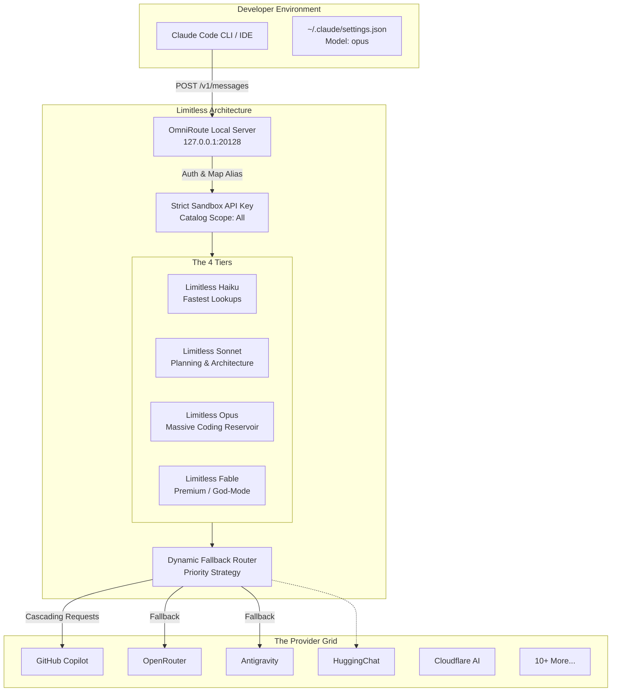

# Limitless Claude 🚀

An ultimate **God-Mode Omnirouting Architecture** designed to seamlessly integrate Claude Code, OmniRoute, and 170+ open-source, free, and premium models into one unified workflow. 

By intelligently intercepting your IDE's requests, Limitless Claude cascades through custom-built tiers of the world's best models—preventing downtime, expanding token reservoirs, and optimizing your coding cost to zero.

## 🌟 The Vision

Limitless Claude was born from a singular goal: **No more rate limits. No more manual model switching. Absolute God-Mode coding capability.**

Instead of relying on a single Anthropic key, this architecture uses OmniRoute as a local proxy (`127.0.0.1:20128`). We dynamically cluster over 700+ discovered models from 15+ global AI providers into **4 strictly curated, fallback-protected Tiers**. If a model times out, hits a quota, or fails, the proxy instantly routes your code to the next elite model in the tier—completely invisibly to your Claude Code interface.

## 🏗️ Architectural Design


```mermaid
flowchart TD
    subgraph Developer Environment
        CC[Claude Code CLI / IDE]
        Settings[~/.claude/settings.json\nModel: opus]
    end

    subgraph Limitless Architecture
        Proxy[OmniRoute Local Server\n127.0.0.1:20128]
        API_Key[Strict Sandbox API Key\nCatalog Scope: All]
        
        subgraph Combos [The 4 Tiers]
            C1[Limitless Haiku\nFastest Lookups]
            C2[Limitless Sonnet\nPlanning & Architecture]
            C3[Limitless Opus\nMassive Coding Reservoir]
            C4[Limitless Fable\nPremium / God-Mode]
        end
        
        Router[Dynamic Fallback Router\nPriority Strategy]
    end

    subgraph The Provider Grid
        P1[GitHub Copilot]
        P2[OpenRouter]
        P3[Antigravity]
        P4[HuggingChat]
        P5[Cloudflare AI]
        P6[10+ More...]
    end

    CC -- "POST /v1/messages" --> Proxy
    Proxy -- "Auth & Map Alias" --> API_Key
    API_Key --> Combos
    Combos --> Router
    Router -- "Cascading Requests" --> P1
    Router -- "Fallback" --> P2
    Router -- "Fallback" --> P3
    Router -.-> P4
```

## 🔋 The 4-Tier Blueprint

Our `setup.js` pipeline dynamically queries your live providers and builds the following intelligent tiers:

1. **Haiku Tier (`limitless-haiku`)**: The absolute fastest responders. Used for rapid, latency-sensitive edits and quick lookups.
2. **Sonnet Tier (`limitless-sonnet`)**: Dedicated to system design, architecture planning, and rigorous chain-of-thought reasoning.
3. **Opus Tier (`limitless-opus`)**: Our massive, uncapped, God-Mode free coding reservoir. Contains 15-20 heavily curated models (Claude 3.5, Gemini Pro, Qwen Max) configured to cascade immediately upon failure.
4. **Fable Tier (`limitless-fable`)**: The budget-protected, highest-tier premium capabilities (e.g., `o1-preview`, God-tier models).

## 🔌 Supported Providers

Limitless automatically harvests models from your active configurations:
- `agentrouter`
- `antigravity`
- `bluesminds`
- `cloudflare-ai`
- `github` *(Copilot Entitlements)*
- `groq`
- `huggingchat`
- `kiro`
- `mistral`
- `ollama-cloud`
- `opencode`
- `openrouter`
- `qwen-web`

## ⚙️ Installation & Workflow

We have streamlined this project to be completely zero-friction. 

**Prerequisites:** 
- Node.js (v22+)
- `pnpm` installed globally

### 1. Install & Boot OmniRoute
```bash
pnpm add -g omniroute@latest
omniroute serve
```
*(Limitless automatically installs a silent VBS script in your Windows Startup folder, meaning OmniRoute will auto-boot in the background every time you turn on your laptop.)*

### 2. Configure Limitless Claude
Clone this repository and build your architecture:
```bash
git clone https://github.com/mahik504/limitless-claude.git
cd limitless-claude
npm install
npm run setup
```

The `setup.js` script will:
1. Scan your live providers.
2. Filter dead models.
3. Construct the 4-Tier system inside OmniRoute.
4. Overwrite your API keys to bypass rate limits.
5. Create Claude Code alias mappings.
6. Install the Windows Startup integration automatically.

### 3. Run Claude Code
Open your terminal and type:
```bash
claude
```
Your CLI is now permanently running through `limitless-opus` with total fallback protection. No 403s, no hangs, no limits.
