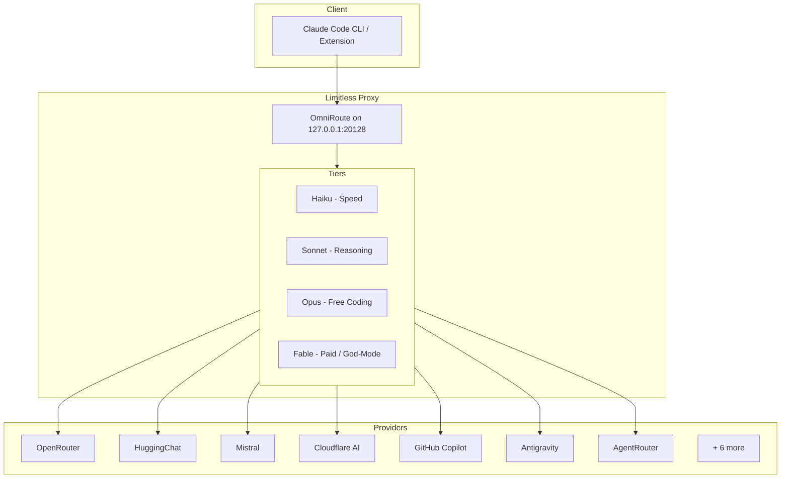

# Limitless Claude

A local omnirouting architecture that connects Claude Code to a massive, auto-switching fleet of AI models. It eliminates rate limits, prevents downtime, and maximizes your free coding token reservoir -- all while keeping the full Claude Code experience intact.

---

## The Vision

Claude Code is the best agentic coding tool available. But a single Anthropic API key has hard rate limits. When you hit the wall, you stop coding.

Limitless Claude solves this permanently. It sits between your Claude Code client and the internet as a local OmniRoute proxy on `127.0.0.1:20128`. Behind that proxy, we dynamically cluster models from 13+ global AI providers into four strictly separated tiers. If a model times out, hits a quota, or goes down, the proxy cascades your request to the next model in the tier instantly and invisibly. You never see an error. You never stop coding.

The current Claude model lineup this architecture is designed around:
- Claude Opus tier combo
- Claude Sonnet tier combo
- Claude Fable tier combo
- Claude Haiku tier combo

The system prompt injected into each tier is grounded directly from the official Anthropic system instructions (sourced from [asgeirtj/system_prompts_leaks](https://github.com/asgeirtj/system_prompts_leaks)), ensuring that even when a request cascades to a non-Anthropic model, the output quality, formatting, and tool-call behavior remain consistent with a native Claude experience.

---

## Architecture


```mermaid
flowchart TD
    subgraph Client
        CC[Claude Code CLI / Extension]
    end

    subgraph Limitless Proxy
        OR[OmniRoute on 127.0.0.1:20128]
        subgraph Tiers
            H[Haiku - Speed]
            S[Sonnet - Reasoning]
            O[Opus - Free Coding]
            F[Fable - Paid / God-Mode]
        end
    end

    subgraph Providers
        P1[OpenRouter]
        P2[HuggingChat]
        P3[Mistral]
        P4[Cloudflare AI]
        P5[GitHub Copilot]
        P6[Antigravity]
        P7[AgentRouter]
        P8[+ 6 more]
    end

    CC --> OR
    OR --> Tiers
    Tiers --> P1
    Tiers --> P2
    Tiers --> P3
    Tiers --> P4
    Tiers --> P5
    Tiers --> P6
    Tiers --> P7
```

---

## The Four Tiers

### Haiku -- Speed
The fastest responders. Used for rapid syntax corrections, quick lookups, and low-latency edits. These models return output in under 3 seconds.

### Sonnet -- Reasoning
Dedicated strictly to system design, architecture planning, debugging, and chain-of-thought reasoning. These are the heaviest thinking engines available for free.

### Opus -- Free Coding Reservoir
The main workhorse. This tier aggregates every available free coding model across OpenRouter, HuggingChat, Mistral, Kiro, Cloudflare, Ollama Cloud, and OpenCode to maximize the number of free tokens you get per day. Antigravity and GitHub Copilot models are intentionally excluded from this tier to preserve their separate quotas for the Fable tier.

Estimated daily volume: **10,000,000+ free tokens.**

### Fable -- Paid / God-Mode
This tier is reserved exclusively for your paid API subscriptions and premium entitlements. It is pre-configured to leverage AgentRouter credits, GitHub Copilot Student entitlements, Antigravity Pro, and low-cost OpenRouter paid models. You use this tier when you need absolute perfection and are willing to spend credits for it.

---

## The \$10 OpenRouter Tip

By default, OpenRouter limits free model usage to roughly 50 requests per day. However, if you deposit just \$10 into your OpenRouter account, your rate limit for free models jumps from 50 to 1,000 requests per day. You do not actually spend the \$10 -- as long as the balance sits there, you get a permanent 20x boost to your free limits.

Because the Opus tier heavily relies on OpenRouter free models (`glm-5.2:free`, `laguna-s-2.1:free`, `qwen3.8-27b:free`), this single deposit unlocks an estimated **8 million additional free tokens every day**.

---

## Supported Providers

The setup script dynamically discovers models from whatever providers you have connected:

- agentrouter
- antigravity
- bluesminds
- cloudflare-ai
- github (Copilot)
- groq
- huggingchat
- kiro
- mistral
- ollama-cloud
- opencode
- openrouter
- qwen-web

If you only have 5 providers connected, the tiers are built from those 5 providers only. Nothing breaks. Nothing is wasted.

---

## Installation

**Prerequisites:**
- Node.js v22 or later
- pnpm installed globally
- Claude Code installed (`npm install -g @anthropic-ai/claude-code`)

### Step 1 -- Install and start OmniRoute

```bash
pnpm add -g omniroute@latest
omniroute serve
```

Leave this running for now. The setup script will install a background daemon so you never have to run this manually again.

### Step 2 -- Connect your providers

Open `http://localhost:20128` in your browser and authenticate the providers you want to use (OpenRouter, HuggingChat, GitHub Copilot, etc).

### Step 3 -- Build the tiers

```bash
git clone https://github.com/mahik504/limitless-claude.git
cd limitless-claude
npm install
npm run setup
```

The setup script will:
1. Query your live providers and filter out dead models.
2. Build the four tiers dynamically based only on your active providers.
3. Inject a grounded system prompt (sourced from the official Anthropic Claude Opus instructions) to maintain output quality across fallback models.
4. Install an invisible auto-recovery daemon to your Windows Startup folder. If OmniRoute crashes, it restarts automatically within 5 seconds.

### Step 4 -- Adding new providers later

If you connect a new provider in OmniRoute at any point in the future, just run:

```bash
npm run setup
```

The tiers will be rebuilt automatically with the new models included.

### Step 5 -- Use Claude Code

```bash
claude
```

That is it. Claude Code is now permanently running through the Limitless Opus tier with full fallback protection. All Claude Code features work natively -- slash commands, `/plan` mode, Ultra Code, agentic execution, medium/high/xhigh effort levels. It works in any terminal, VS Code, Cursor, or Antigravity IDE.

---

## What happens after 10 days of not using it?

Nothing. You turn on your laptop, the invisible daemon boots OmniRoute silently in the background, and when you type `claude` in your terminal it works exactly as before. No manual steps needed. If OmniRoute ever crashes, the daemon catches it and restarts it within 5 seconds.

---

## License

MIT
