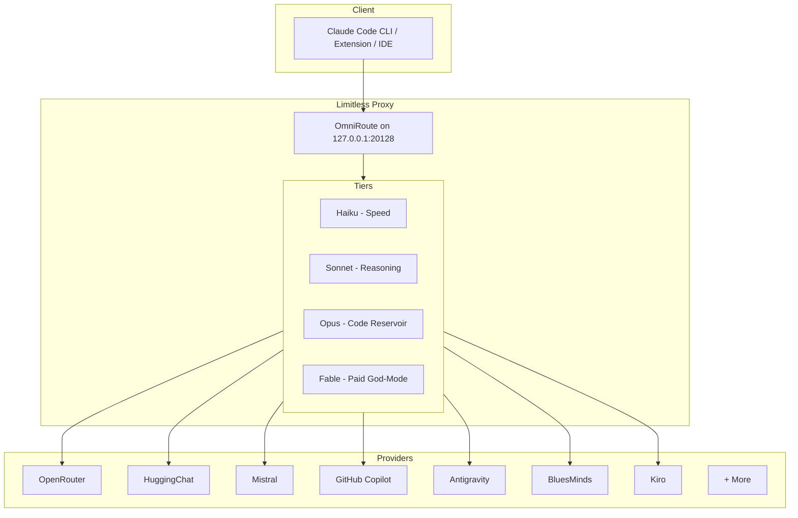

# Limitless Claude v4.4.0

A local omnirouting architecture that connects Claude Code to a massive, auto-switching fleet of AI models. It eliminates rate limits, prevents downtime, and maximizes your free coding token reservoir — all while keeping the full Claude Code experience intact.

This acts as a transparent, system-level proxy. When Claude Code attempts to communicate with the Anthropic API, Limitless Claude intercepts the traffic and routes it to `http://127.0.0.1:20128`.

The current Claude model lineup this architecture is designed around:
- **Claude Opus tier combo** (17 Models - Load-Balanced)
- **Claude Fable tier combo** (6 Models - Premium God-Mode)
- **Claude Haiku tier combo** (7 Models - Priority Waterfall)
- **Claude Sonnet tier combo** (6 Models - Priority Waterfall)

### Advanced Agentic System Prompts
The system prompt injected into each tier is grounded directly from official Anthropic system instructions and specifically optimized for multi-agent development. 
- **Opus 5.5:** Guided for massive refactors, ultra-code tasks, and backend multi-agent orchestration.
- **Sonnet 5.5:** Guided for chain-of-thought architectural reasoning and planning.
- **Haiku 4.5:** Guided for instantaneous syntax lookups and rapid execution.
- **Fable 5.2:** Guided for God-mode premium coding synthesis.
This ensures that even when a request cascades to a non-Anthropic model (like Qwen or DeepSeek), the output quality, formatting, and `claude say` tool-call behaviors remain 100% native to Claude Code.

---

## Architecture


```mermaid
flowchart TD
    subgraph Client
        CC[Claude Code CLI / Extension / IDE]
    end

    subgraph Limitless Proxy
        OR[OmniRoute on 127.0.0.1:20128]
        subgraph Tiers
            H[Haiku - Speed]
            S[Sonnet - Reasoning]
            O[Opus - Code Reservoir]
            F[Fable - Paid God-Mode]
        end
    end

    subgraph Providers
        P1[OpenRouter]
        P2[HuggingChat]
        P3[Mistral]
        P4[GitHub Copilot]
        P5[Antigravity]
        P6[BluesMinds]
        P7[Kiro]
        P8[+ More]
    end

    CC --> OR
    OR --> Tiers
    Tiers --> P1
    Tiers --> P2
    Tiers --> P3
    Tiers --> P4
    Tiers --> P5
    Tiers --> P6
    Tiers --> P7
```

---

## The Four Tiers & Configured Models

To ensure rate limits are spread perfectly, **Opus** and **Fable** utilize a **Round-Robin** load-balancing strategy, meaning requests are distributed sequentially across your top models. **Haiku** and **Sonnet** use a strict **Priority** cascade for maximum latency optimization.

*(Note: The setup script dynamically filters this list based on your live providers. If you lack a provider, that model is safely skipped).*

### Haiku — Speed
The fastest responders. Used for rapid syntax corrections, quick lookups, and low-latency edits.
1. `github/gpt-4o-mini`
2. `antigravity/gemini-3.1-flash-lite`
3. `kiro/qwen3-coder-next`
4. `groq/llama-3.1-8b-instant`
5. `openrouter/z-ai/glm-5.2:free`
6. `openrouter/qwen/qwen3.8-27b:free`
7. `openrouter/nvidia/nemotron-3.5-lightning:free`
*Estimated daily tokens: ~1,500,000+ tokens*

### Sonnet — Reasoning
Dedicated strictly to system design, architecture planning, debugging, and chain-of-thought reasoning. 
1. `antigravity/claude-sonnet-4-6`
2. `kiro/glm-5`
3. `antigravity/claude-opus-4-6-thinking`
4. `bluesminds/deepseek-reasoner`
5. `huggingchat/CohereLabs/command-a-reasoning-08-2025`
*Estimated daily tokens: ~2,500,000+ tokens*

### Opus — Free Coding Reservoir
The massive workhorse tier. We extract every free coding model available across the ecosystem. This tier uses a **load-balanced (round-robin) strategy** so your OpenRouter requests are perfectly distributed across the best models without bottlenecking.
1. `kiro/qwen3-coder-next`
2. `mistral/codestral-latest`
3. `kiro/deepseek-3.2`
4. `openrouter/z-ai/glm-5.2:free`
5. `openrouter/qwen/qwen3.8-27b:free`
6. `openrouter/poolside/laguna-s-2.1:free`
7. `bluesminds/gpt-5.5`
8. `ollama-cloud/glm-5.3`
9. `bluesminds/kimi-k3`
10. `kiro/glm-5`
11. `openrouter/liquid/lfm-2.5-2.6b:free`
12. `huggingchat/deepseek-ai/DeepSeek-V4-Pro`
13. `huggingchat/Qwen/Qwen3.6-27B`
14. `opencode/deepseek-v4-flash-free`
15. `opencode/big-pickle`
16. `muse-spark-web/muse-spark-thinking`
17. `muse-spark-web/muse-spark`
*Estimated daily tokens (with \$10 OpenRouter unlock): ~14,000,000+ free tokens.*

### Fable — Paid / God-Mode
Reserved exclusively for your paid subscriptions and premium entitlements. "Mini" models have been stripped out to guarantee that every single request mathematically targets a God-tier model. Load-balanced (round-robin) strategy.
1. `github/gpt-4o-2024-11-20`
2. `antigravity/claude-opus-4-6-thinking`
3. `antigravity/gemini-3.1-pro-low`
4. `openrouter/moonshotai/kimi-k3`
5. `openrouter/z-ai/glm-5.3`
6. `openrouter/qwen/qwen-3.8-coder-32b-instruct`
*Estimated daily volume: ~10,000,000+ premium tokens.*

---

## Total Network Capacity
When fully configured with the \$10 OpenRouter unlock, this Limitless proxy pushes **~28,000,000 combined tokens per day** seamlessly through your terminal.

---

## The \$10 OpenRouter Tip

By default, OpenRouter limits free model usage to roughly 50 requests per day. However, if you deposit just \$10 into your OpenRouter account, your rate limit for free models jumps from 50 to 1,000 requests per day. You do not actually spend the \$10 — as long as the balance sits there, you get a permanent 20x boost to your free limits.

Because the Opus tier heavily relies on OpenRouter free models, this single deposit unlocks an estimated **8 million additional free tokens every day**. Because the Opus and Fable tiers use load-balancing, your 1000 requests won't all be wasted on a single model.

---

## Supported Providers

The setup script dynamically discovers models from whatever providers you have connected:
- antigravity
- bluesminds
- github (Copilot)
- groq
- huggingchat
- kiro
- mistral
- ollama-cloud
- opencode
- openrouter
- muse-spark-web

If you only have 5 providers connected, the tiers are built from those 5 providers only. Nothing breaks. Nothing is wasted.

---

## Installation

**Prerequisites:**
- Node.js v22 or later
- pnpm installed globally
- Claude Code installed (`npm install -g @anthropic-ai/claude-code`)

### Step 1 — Install and start OmniRoute

```bash
pnpm add -g omniroute@latest
omniroute serve
```

Leave this running for now. The setup script will install a background daemon so you never have to run this manually again.

### Step 2 — Connect your providers

Open `http://localhost:20128` in your browser and authenticate the providers you want to use (OpenRouter, HuggingChat, GitHub Copilot, etc).

### Step 3 — Build the tiers

```bash
git clone https://github.com/mahik504/limitless-claude.git
cd limitless-claude
npm install
npm run setup
```

The setup script will:
1. Query your live providers and filter out dead models.
2. Build the four tiers dynamically based only on your active providers.
3. Inject grounded system prompts into all four tiers.
4. Install an invisible auto-recovery daemon. For Windows, it creates a silent VBScript in Startup. For macOS/Linux, it generates a `start-daemon.sh` script.

### Step 4 — Adding new providers later

If you connect a new provider in OmniRoute at any point in the future, just run:

```bash
npm run setup
```

The tiers will be rebuilt automatically with the new models included.

### Step 5 — Use Claude Code

```bash
claude
```

That is it. Claude Code is now permanently running through the Limitless architecture with full fallback protection. All Claude Code features work natively — slash commands, `/plan` mode, Ultra Code, agentic execution. It works in any terminal, VS Code, Cursor, or Antigravity IDE. You can also point any other application directly at the `http://127.0.0.1:20128/v1` API.

---

## What happens after 10 days of not using it?

Nothing. On Windows, you turn on your laptop, the invisible daemon boots OmniRoute silently in the background, and when you type `claude` in your terminal it works exactly as before. No manual steps needed. If OmniRoute ever crashes, the daemon catches it and restarts it within 5 seconds.

---

## License

MIT
