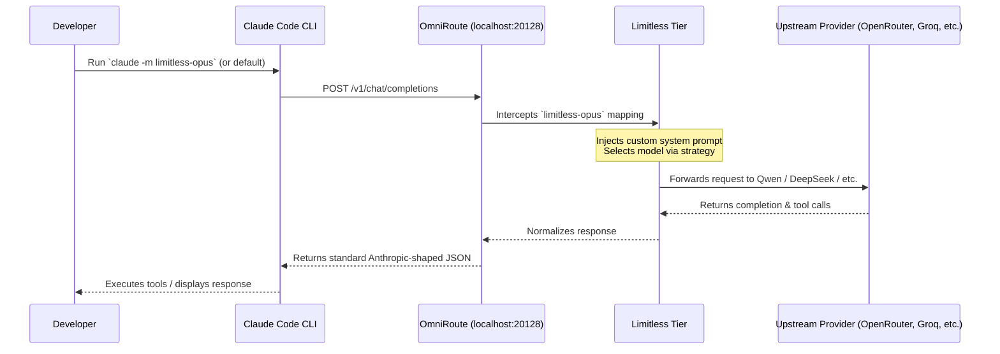

# Limitless Claude Architecture

Limitless Claude connects the powerful, agentic development workflow of **Claude Code** to a dynamic fleet of third-party AI models via **OmniRoute**. 

This document explains the request lifecycle, the routing tier architecture, and how the setup script safely maps your available models into Claude Code.

## 1. The Request Lifecycle

## 2. Component Boundaries

Limitless Claude is fundamentally a configuration and orchestration harness. It relies on two powerful external systems:

1. **Claude Code**: The official CLI tool from Anthropic. It handles the local file system execution, Git reading, test execution, and the Terminal UI.
2. **OmniRoute**: A unified local AI gateway. It normalizes provider formats (e.g., converting an OpenAI API request into a Google Gemini API request) and handles fallback networking.

**Limitless Claude's Job** is to bridge the two securely. It dynamically reads your authenticated OmniRoute providers, builds four internal "Tiers" (Combos), injects optimized agentic system prompts, and registers them as aliases that Claude Code natively understands (e.g., intercepting Claude Code's internal `claude-3-5-sonnet-20241022` strings and redirecting them).

## 3. The Four Tiers and Routing Strategies

Limitless Claude categorizes all discovered models into four distinct combos (Tiers):

### Priority Routing (Waterfall)
Used for **Haiku** and **Sonnet**.
- **How it works:** OmniRoute will always attempt to send the request to Model #1. If Model #1 rate-limits or times out, it instantly falls back to Model #2, then #3, etc.
- **Why:** Maximum latency optimization and reasoning consistency. You always want your smartest (or fastest) model answering, relying on fallbacks only during outages.

### Round-Robin Routing (Load-Balanced)
Used for **Opus** and **Fable**.
- **How it works:** OmniRoute sequentially rotates requests. Request #1 goes to Model A. Request #2 goes to Model B. Request #3 goes to Model C.
- **Why:** To completely bypass Requests-Per-Minute (RPM) limits on free or shared APIs. By cycling through 15+ models, your Opus tier can generate massive volumes of tokens without triggering a single provider's rate limit.

## 4. Startup and Recovery Architecture

To ensure a seamless Developer Experience, Limitless Claude runs OmniRoute entirely in the background.

- **On Windows:** During setup, an invisible `Limitless-OmniRoute-Launcher.vbs` script is safely placed in your `Startup` folder. This script boots a hidden batch file that runs `omniroute serve` in a continuous loop. If it crashes, it restarts within 5 seconds.
- **Database Safety:** The setup script (`scripts/setup.js`) uses atomic SQLite transactions (`db.transaction()`) to modify OmniRoute's `storage.sqlite` database. It backs up the database to `storage.sqlite.bak` before making any changes.

Because everything is handled transparently, you simply type `claude` in your terminal and it connects immediately.
